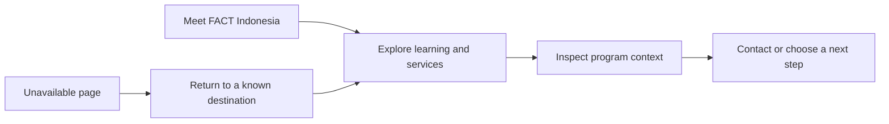
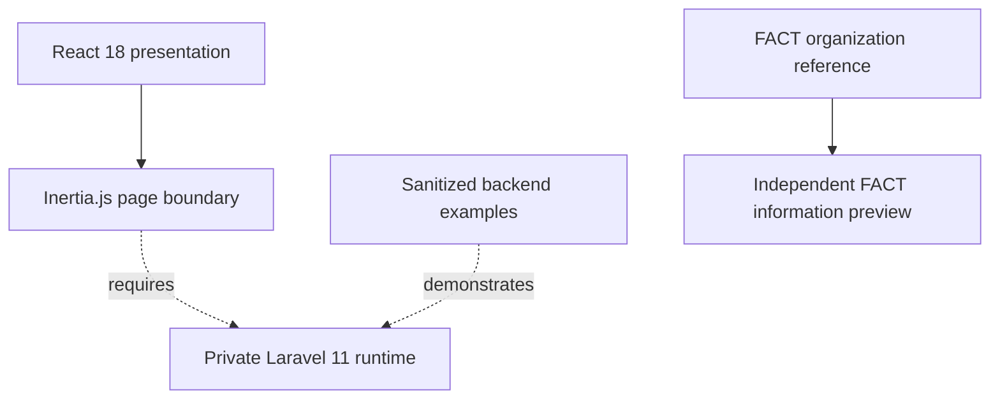

<p align="center">
  
</p>

<h1 align="center">FACT Indonesia</h1>

<p align="center">
  A learning-focused digital presence for training, consultancy,
  creative growth, and meaningful professional development.
</p>

<p align="center">
  <a href="https://fact-indonesia.com/">Official Website</a>
  &nbsp; / &nbsp;
  <a href="docs/gallery.md">Visual Gallery</a>
  &nbsp; / &nbsp;
  <a href="SOURCE-CODE.md">Published Source</a>
</p>

<p align="center">
  
  
  
  
  
  
</p>

> [!IMPORTANT]
> This repository brings together a FACT Indonesia visual case study and the
> shared frontend and sanitized Laravel examples from RoyalVilla. A separate,
> runnable FACT information preview now provides service discovery and contact.
> The inherited code still uses the property domain, and the supplied mockups
> remain a separate design concept. This is not the source of the official FACT
> website or a completed learning platform. Private runtime and customer data
> are excluded.

## Overview

FACT stands for Focus Area Collaborative Team. The organization works in
training and consultancy, with an emphasis on personal capability, organizational
development, entrepreneurship, and creative participation. Its official profile
provides the business context for this portfolio.
[About FACT Indonesia](https://fact-indonesia.com/profile/).

The visual concept turns that context into an approachable learning experience:
clear program discovery, a confident institutional identity, purposeful calls
to action, and a coherent path back when a page cannot be found.

The engineering publication starts from an existing RoyalVilla foundation
rather than presenting a separately completed FACT application. This keeps the
source origin reviewable and makes the remaining adaptation work explicit.
The standalone FACT preview adds a verified information journey without
initializing the inherited account, property, payment, or tracking runtime.

## Product At A Glance

| Area | FACT Portfolio Direction |
| --- | --- |
| Institutional identity | A clear introduction to the organization and its development focus |
| Learning discovery | A browsable course and service concept illustrated in the supplied catalogue mockup |
| Program context | Readable information that supports comparison and informed contact |
| Professional growth | A business context for capability development and career transitions |
| Creative participation | A direction for entrepreneurship, collaboration, and community engagement |
| Recovery | A designed not-found state with a clear return path |

These are business and design directions. The current source does not implement
FACT enrollment, learner progress, certificate issuance, or production checkout.

## Service Context

The official site presents the following service categories:

- Pre Retirement Training.
- Pelatihan Kewirausahaan dan Pendampingan Usaha.
- CSR & Layanan Riset.
- Event Organizer.
- Outplacement & Capacity Building.

The reference taxonomy is recorded in
[`factIndonesia.json`](resources/js/Data/factIndonesia.json).
It reflects the [official service overview](https://fact-indonesia.com/), not
an inventory of scheduled courses or a production learning platform.

## Standalone FACT Preview

The second publication batch implements an independent React information
surface using the official service taxonomy:

| Implemented Surface | Behavior |
| --- | --- |
| Service discovery | Five reference services, text search, category filter, and announced result counts |
| Catalogue states | Explicit loading, error, empty inventory, and no-match recovery |
| Service detail | Shareable selections, native modal dialogs, Escape, and browser-history navigation |
| Organization | A reusable profile connected to the official reference content |
| FAQ | Keyboard-operable native disclosures and labelled reference/policy content |
| Contact | Verified outbound website/profile links, without participant forms or payment calls |
| Quality | Content contracts, source checks, asset checksums, import-boundary checks, and CI |

```bash
npm ci
npm run dev:fact
```

Open `/fact-preview.html` on the local URL printed by Vite. This preview does
not require Laravel. Its production bundle is generated with
`npm run build:fact` in the ignored `dist-fact` directory. See the
[preview guide](docs/preview.md) and [content contract](docs/product/content-contract.md).

## Experience Model



The standalone preview implements discovery, service detail, FAQ, and official
contact. Enrollment, payments, participant accounts, learning progress, and
certificate issuance remain outside the implemented journey.

## Selected Experiences

<table>
  <tr>
    <td width="50%">
      
    </td>
    <td width="50%">
      
    </td>
  </tr>
  <tr>
    <td align="center"><strong>Learning catalogue concept</strong></td>
    <td align="center"><strong>Considered recovery experience</strong></td>
  </tr>
</table>

These owner-supplied visuals represent the FACT design concept. They are not
screenshots rendered by the inherited source. See the complete
[visual gallery](docs/gallery.md) for asset provenance.

## Shared Engineering Foundation

The published source retains RoyalVilla's React interface and curated Laravel
examples. It covers reusable patterns for layouts, controls, request state,
account screens, payment feedback, administration, validation, and moderation.



The runtime shown above is intentionally not included. Read the
[architecture overview](docs/architecture/overview.md) and
[source provenance](docs/provenance.md) before interpreting the inherited
property, account, payment, or administration flows as FACT features.

## Technology Profile

| Layer | Technology | Published Responsibility |
| --- | --- | --- |
| Interface | React 18, Inertia.js 2 | Standalone FACT preview and inherited server-driven navigation patterns |
| Styling | Scoped CSS, Tailwind CSS 3 | FACT information styling and inherited interface states |
| Tooling | Vite 6 | Development and production frontend asset pipeline |
| Interaction | Swiper, Framer Motion | Inherited collections and transition patterns |
| Backend examples | PHP 8.2+, Laravel 11 | Sanitized models, validation, catalogue queries, and transactional moderation |
| Content | Local JSON and validators | FACT organization, service records, FAQ, and source provenance |
| Verification | Node test runner, GitHub Actions | Content, publication, import graph, and both frontend builds |

## Published Source

`resources` contains the inherited presentation layer. `public` contains its
fonts and interface assets. `backend` contains selected, sanitized Laravel
examples that remain in their original RoyalVilla namespace.

The import deliberately preserves source terminology instead of pretending
that a property listing is already a training program. FACT information records
and components are separate from the inherited property domain. Production
enrollment, learner permissions, and transaction rules remain adaptation work.

The exact inclusion and exclusion boundary is documented in
[SOURCE-CODE.md](SOURCE-CODE.md).

## Verification

```bash
npm ci
npm test
npm run build
npm run build:fact
npm run check:publication
```

These commands verify the FACT contracts and publication boundary and build
both frontend surfaces. They do not launch the omitted Laravel application or
deploy the official website. Backend feature examples require their private
application wiring. See [verification and limits](docs/quality/verification.md).

## Trust And Privacy

The publication excludes environment files, credentials, database exports,
runtime routes, authentication services, payment operations, session records,
logs, personal documents, customer uploads, and deployment infrastructure.

A future training platform would need its own consent, participant-data,
authorization, enrollment, payment, and certificate policies. Those controls
are not inferred from the inherited marketplace examples.

## Documentation Map

| Collection | Focus |
| --- | --- |
| [Source boundary](SOURCE-CODE.md) | Included engineering material and private exclusions |
| [Provenance](docs/provenance.md) | Shared RoyalVilla origin and independent FACT publication |
| [Product context](docs/product/context.md) | Audiences and business direction |
| [Architecture](docs/architecture/overview.md) | Source responsibilities and runtime boundary |
| [Design](docs/design/overview.md) | FACT mockup direction versus inherited styling |
| [Gallery](docs/gallery.md) | Supplied home, catalogue, and recovery visuals |
| [References](docs/sources.md) | Official sources used for context |
| [Preview](docs/preview.md) | Running the independent FACT information surface |
| [Content contract](docs/product/content-contract.md) | Service taxonomy, source review, and data boundaries |
| [Roadmap](docs/roadmap.md) | Substantive adaptation and verification work |

The full index is available in [docs/README.md](docs/README.md).

## Project Status

Fact-Indonesia is a portfolio case study with a runnable information preview,
a shared source foundation, and separate supplied mockups. It is not a
production learning service or a claim of ownership of the official website.

## Ownership

Published and maintained by [ibamzjr](https://github.com/ibamzjr).
FACT Indonesia and other third-party names remain associated with their
respective rights holders.

Copyright (c) 2026 ibamzjr. All rights reserved. See
[LICENSE.md](LICENSE.md) and [NOTICE.md](NOTICE.md) for repository terms.
