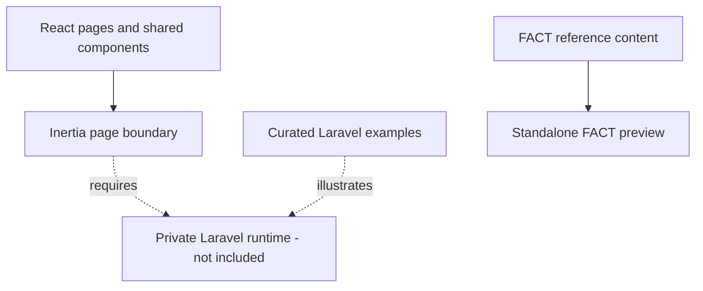

# Architecture Overview

The inherited application uses React 18 with Inertia.js 2 and Laravel 11.
This repository publishes the presentation layer and curated backend patterns,
not a complete deployable application. A separate FACT preview has its own
HTML entry and Vite configuration and does not require that runtime.

## Responsibility Map

| Location | Responsibility |
| --- | --- |
| `resources/js/Pages` | Inherited public, account, payment, and administrator pages |
| `resources/js/Components` | Shared controls, navigation, visual collections, and loading states |
| `resources/js/hooks` | Reusable interface and request behavior |
| `resources/js/contexts` | Shared property presentation state |
| `resources/js/Data/factIndonesia.json` | FACT organization reference and service taxonomy |
| `resources/js/Data/factPrograms.json`, `factFaq.json` | Service summaries and FAQ with source references |
| `resources/js/fact` | Content, navigation, selection, and provenance contracts |
| `resources/js/Components/Fact`, `Pages/Fact` | Independent FACT information presentation |
| `fact-preview.html`, `vite.fact.config.js` | Standalone entry and build boundary |
| `tests/fact`, `scripts`, `.github/workflows` | Contract, import, publication, and CI checks |
| `resources/css`, `public` | Styling, fonts, and inherited interface media |
| `backend` | Sanitized Laravel workflow examples |

Adapting to FACT requires a deliberate content and service model, appropriate
authorization, and a verified enrollment/payment design where needed. No
mapping from property submissions to learner records is assumed.

Service discovery uses synchronous validated data. Search/filter state stays
local, while the selected service slug is reflected in browser history. Detail
uses a native modal dialog with body-scroll cleanup. FAQ uses native disclosures;
there are no animation loops or artificial request timers in the preview.
The build-graph test checks that the standalone entry does not import inherited
property, account, payment, or analytics initialization.
