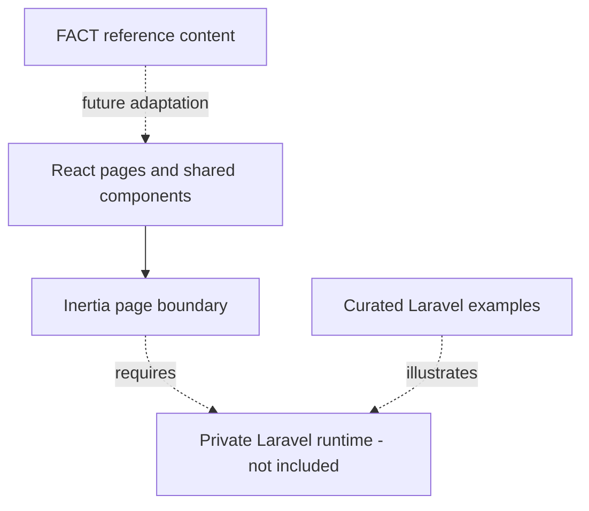

# Architecture Overview

The inherited application uses React 18 with Inertia.js 2 and Laravel 11.
This repository publishes the presentation layer and curated backend patterns,
not a complete deployable application.

## Responsibility Map

| Location | Responsibility |
| --- | --- |
| `resources/js/Pages` | Inherited public, account, payment, and administrator pages |
| `resources/js/Components` | Shared controls, navigation, visual collections, and loading states |
| `resources/js/hooks` | Reusable interface and request behavior |
| `resources/js/contexts` | Shared property presentation state |
| `resources/js/Data/factIndonesia.json` | FACT organization reference and service taxonomy |
| `resources/css`, `public` | Styling, fonts, and inherited interface media |
| `backend` | Sanitized Laravel workflow examples |

Adapting to FACT requires a deliberate content and service model, appropriate
authorization, and a verified enrollment/payment design where needed. No
mapping from property submissions to learner records is assumed.
