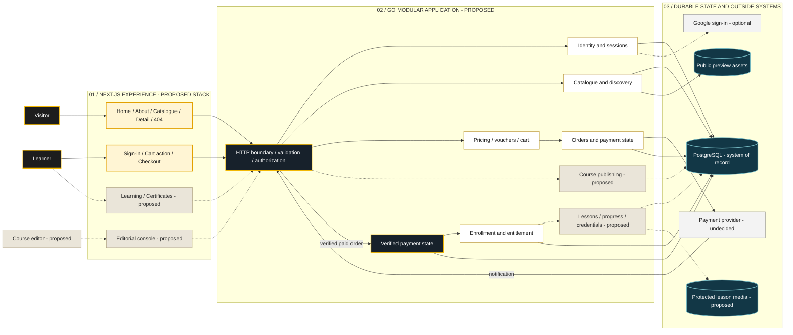
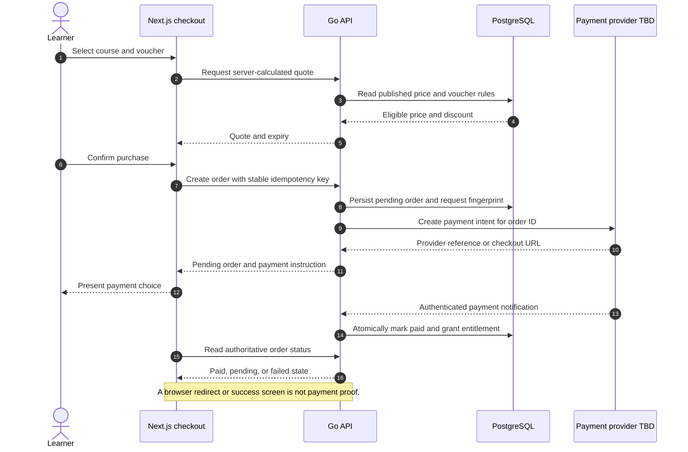
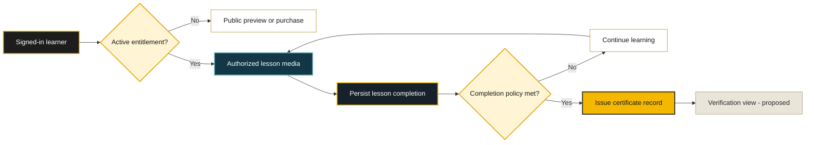
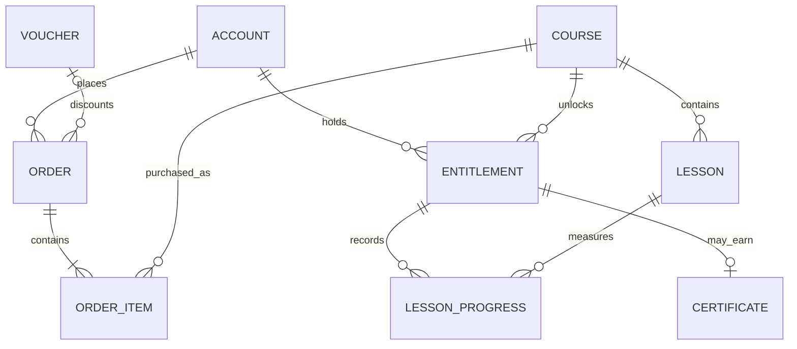

# FACT Indonesia - Learning Platform Architecture

> **Design direction, not a deployed-system inventory.** The public repository
> contains showcase images and documents. Next.js, Go, PostgreSQL, storage,
> payment, and learning services below are a proposed private implementation.

A learning platform should feel simple to explore while keeping identity,
money, course access, and achievement decisions explicit behind the interface.
The diagrams below translate the visible prototype into a coherent system
model without treating mockup data as production evidence.

## What The Prototype Actually Shows

The prototype review covered both named flows in the [FACT prototype](https://www.figma.com/proto/DaUF428JV28rilJxGucJUO?node-id=0-1):
six reachable frames in Flow 1 and five in Flow 2. Both loop back to their
start. This is the reachable prototype, not an inventory of detached Figma
artboards or a working application.

| Flow | Reachable frames | Architecture signal |
| --- | --- | --- |
| 1 | Home, catalogue, course detail, sign-in, about, unavailable page | Public discovery, account entry, content and recovery states |
| 2 | Checkout, payment-selection overlay, signed-in home, catalogue variant, course-detail variant | Purchase intent, payment handoff, signed-in presentation |

The catalogue shows search, filters, prices, ratings, and course cards. Course
detail shows a media preview, category, author, description, voucher field,
buy-now and cart actions, and related courses. Checkout shows a course summary,
discount, total, payment choices, buyer fields, and a submit action. A Google
sign-in option and a **Sertifikat** navigation item are visible. The prototype
does **not** show a working lesson player, progress tracking, certificate
issuance, content editor, or verified payment callback. The payment overlay's
amount differs from the checkout total, so neither is a valid source of truth
for an actual order. Provider branding in that overlay is illustrative.

## 01 / Platform Map

The main design is a **modular Go application**, with one clear API boundary
and PostgreSQL as the system of record. It does not need separate microservices
or a search cluster merely because the product has many course cards.

```mermaid
flowchart LR
    Visitor["Visitor"]:::actor
    Learner["Learner"]:::actor
    Editor["Course editor - proposed"]:::future

    subgraph Web["01 / NEXT.JS EXPERIENCE - PROPOSED STACK"]
        direction TB
        Public["Home / About / Catalogue / Detail / 404"]:::screen
        Purchase["Sign-in / Cart action / Checkout"]:::screen
        StudyUI["Learning / Certificates - proposed"]:::future
        Studio["Editorial console - proposed"]:::future
    end

    subgraph App["02 / GO MODULAR APPLICATION - PROPOSED"]
        direction TB
        API["HTTP boundary / validation / authorization"]:::core
        Identity["Identity and sessions"]:::module
        Catalogue["Catalogue and discovery"]:::module
        Commerce["Pricing / vouchers / cart"]:::module
        Orders["Orders and payment state"]:::module
        Confirmed["Verified payment state"]:::core
        Access["Enrollment and entitlement"]:::module
        Learning["Lessons / progress / credentials - proposed"]:::future
        Editorial["Course publishing - proposed"]:::future

        API --> Identity
        API --> Catalogue
        API --> Commerce
        Commerce --> Orders
        Access -.-> Learning
        API -.-> Editorial
    end

    subgraph State["03 / DURABLE STATE AND OUTSIDE SYSTEMS"]
        direction TB
        DB[("PostgreSQL - system of record")]:::store
        Preview[("Public preview assets")]:::store
        Media[("Protected lesson media - proposed")]:::store
        Gateway["Payment provider - undecided"]:::external
        Google["Google sign-in - optional"]:::external
    end

    Visitor --> Public
    Learner --> Purchase
    Learner -.-> StudyUI
    Editor -.-> Studio
    Public --> API
    Purchase --> API
    StudyUI -.-> API
    Studio -.-> API
    Orders --> Gateway
    Gateway -->|notification| API
    API -->|verified paid order| Confirmed
    Confirmed --> Access
    Identity --> DB
    Catalogue --> DB
    Orders --> DB
    Confirmed --> DB
    Access --> DB
    Learning -.-> DB
    Editorial -.-> DB
    Catalogue --> Preview
    Learning -.-> Media
    Identity -.-> Google

    classDef actor fill:#1D1D1D,stroke:#F4B800,color:#FFFFFF,stroke-width:2px
    classDef screen fill:#FFF5D4,stroke:#E3A100,color:#171717,stroke-width:2px
    classDef core fill:#17212B,stroke:#F4B800,color:#FFFFFF,stroke-width:2px
    classDef module fill:#FFFFFF,stroke:#B7902D,color:#171717,stroke-width:1px
    classDef store fill:#123746,stroke:#72B5BE,color:#FFFFFF,stroke-width:2px
    classDef external fill:#F3F3F3,stroke:#858585,color:#171717,stroke-width:1px
    classDef future fill:#EAE5D9,stroke:#A89A78,color:#292929,stroke-width:1px
```

Solid connections map the core experience and its necessary responsibilities.
Dashed connections are future-facing capabilities or integrations whose full
journey is not shown. The technology labels describe the owner's chosen
direction, not the implementation of the official website.

| Boundary | Responsibility | Data or trust rule |
| --- | --- | --- |
| Next.js | Render public discovery, account entry, cart and checkout | Display server-provided prices and access; never decide either locally |
| Go identity and catalogue | Authenticate sessions and serve bounded course discovery | Keep private account data separate from public course content |
| Go commerce and orders | Calculate voucher quotes, create orders, reconcile payment state | Stable idempotency keys and server-calculated amounts |
| Go entitlement | Grant course access only after authoritative payment confirmation | One order effect must not grant duplicate access |
| Go learning and editorial | Govern lessons, progress, certificates, and publishing | Proposed; no learner or editor screens prove these workflows yet |
| PostgreSQL | Hold courses, identities, vouchers, orders, entitlements, and later progress | Transactional source of truth; not a browser-side store |
| Preview, private media, and payment | Separate public course artwork from protected lessons and settle purchases | Providers, hosting, and access policies remain undecided |

## 02 / Purchase Becomes Access

The checkout and payment overlay motivate this sequence; they do not prove
that any payment integration exists. In particular, the browser returning
from a payment window cannot unlock a course by itself.

```mermaid
sequenceDiagram
    autonumber
    actor Learner
    participant Web as Next.js checkout
    participant API as Go API
    participant DB as PostgreSQL
    participant Pay as Payment provider TBD

    Learner->>Web: Select course and voucher
    Web->>API: Request server-calculated quote
    API->>DB: Read published price and voucher rules
    DB-->>API: Eligible price and discount
    API-->>Web: Quote and expiry
    Learner->>Web: Confirm purchase
    Web->>API: Create order with stable idempotency key
    API->>DB: Persist pending order and request fingerprint
    API->>Pay: Create payment intent for order ID
    Pay-->>API: Provider reference or checkout URL
    API-->>Web: Pending order and payment instruction
    Web-->>Learner: Present payment choice
    Pay-->>API: Authenticated payment notification
    API->>DB: Atomically mark paid and grant entitlement
    Web->>API: Read authoritative order status
    API-->>Web: Paid, pending, or failed state
    Note over Web,API: A browser redirect or success screen is not payment proof.
```

The design must reject a reused idempotency key with a different order body,
handle repeated or delayed payment notifications, and retain an unknown state
when a provider call times out. A callback must be authenticated and reconciled
against the stored order amount before granting access. The exact gateway and
its webhook contract are undecided.

## 03 / Learning And Certificate Path

This is **future platform architecture**, not a flow demonstrated by the
prototype. The visible course preview and certificate navigation establish
product intent only.

```mermaid
flowchart LR
    Signed["Signed-in learner"]:::actor --> Gate{"Active entitlement?"}:::decision
    Gate -- No --> Preview["Public preview or purchase"]:::screen
    Gate -- Yes --> Lesson["Authorized lesson media"]:::store
    Lesson --> Progress["Persist lesson completion"]:::core
    Progress --> Policy{"Completion policy met?"}:::decision
    Policy -- No --> Continue["Continue learning"]:::screen
    Continue --> Lesson
    Policy -- Yes --> Issue["Issue certificate record"]:::gold
    Issue --> Verify["Verification view - proposed"]:::future

    classDef actor fill:#1D1D1D,stroke:#F4B800,color:#FFFFFF,stroke-width:2px
    classDef decision fill:#FFF5D4,stroke:#E3A100,color:#171717,stroke-width:2px
    classDef screen fill:#FFFFFF,stroke:#B7902D,color:#171717,stroke-width:1px
    classDef core fill:#17212B,stroke:#F4B800,color:#FFFFFF,stroke-width:2px
    classDef store fill:#123746,stroke:#72B5BE,color:#FFFFFF,stroke-width:2px
    classDef gold fill:#F4B800,stroke:#171717,color:#171717,stroke-width:2px
    classDef future fill:#EAE5D9,stroke:#A89A78,color:#292929,stroke-width:1px
```

The server would own progress and eligibility rules. Course playback, lesson
completion, certificate generation, and public verification need separate
product decisions and evidence before they can be called implemented.

## 04 / Conceptual Data Relationships

This ER model makes the domain boundaries reviewable. Entity names and
cardinalities are **proposed**, not a published PostgreSQL schema.

```mermaid
erDiagram
    ACCOUNT ||--o{ ORDER : places
    ORDER ||--|{ ORDER_ITEM : contains
    COURSE ||--o{ ORDER_ITEM : purchased_as
    VOUCHER o|--o{ ORDER : discounts
    ACCOUNT ||--o{ ENTITLEMENT : holds
    COURSE ||--o{ ENTITLEMENT : unlocks
    COURSE ||--o{ LESSON : contains
    ENTITLEMENT ||--o{ LESSON_PROGRESS : records
    LESSON ||--o{ LESSON_PROGRESS : measures
    ENTITLEMENT ||--o| CERTIFICATE : may_earn
```

The owner still needs to decide how multi-course orders, refunds, certificate
revocation, course versioning, instructor permissions, and media retention
work. The public showcase cannot certify those rules or any deployed database.

For visual cues, read the [design notes](../design/overview.md). For what is
actually distributed, read the [source policy](../../SOURCE-CODE.md).
