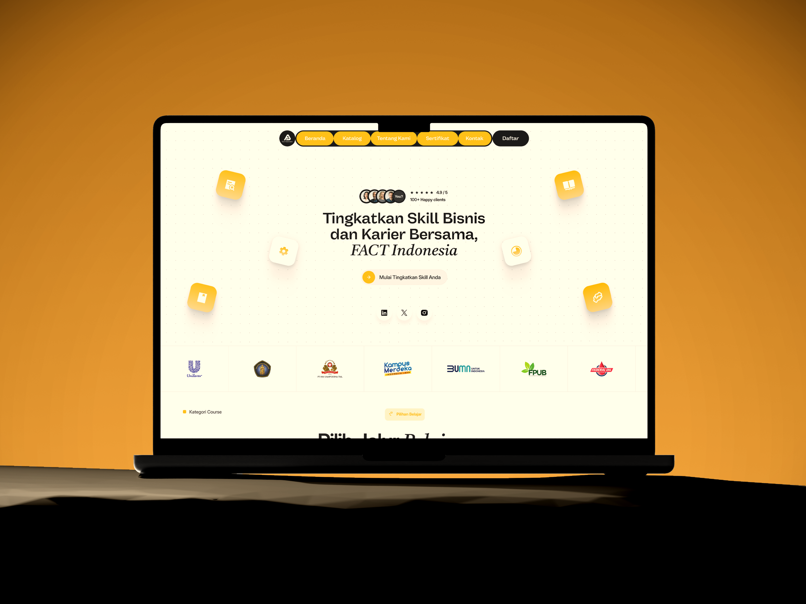

# Visual Gallery

The gallery uses the owner's supplied FACT Indonesia portfolio mockups.
Original exports remain unchanged outside the repository.

## Home And Institutional Identity

## Learning Catalogue

## Not-Found Recovery

## Asset Provenance

| Supplied File | Published Asset |
| --- | --- |
| `Hero.png` | `assets/fact-indonesia-hero.png` |
| `Kiri.png` | `assets/fact-indonesia-catalogue.png` |
| `Kanan.png` | `assets/fact-indonesia-recovery.png` |

The originals were supplied from the owner's Royalvilla asset folder. These
are unchanged PNG copies with project-specific filenames. The unrelated
`hero.webp` in that folder is not included.

The [asset manifest](../assets/manifest.json) records original filenames,
byte sizes, and SHA-256 checksums. Automated publication checks verify that all
three copies remain unchanged; the original external folder is not required
to run CI.

The images are design mockups, not evidence that the imported React source
implements these FACT screens. Text, ratings, course prices, and logos inside
the mockups are presentation content, not independently verified live data.
